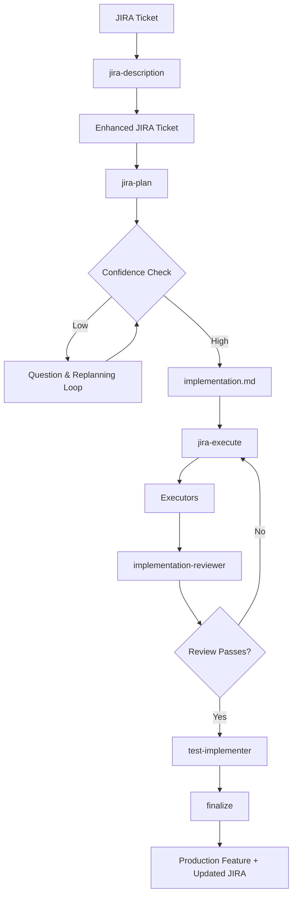
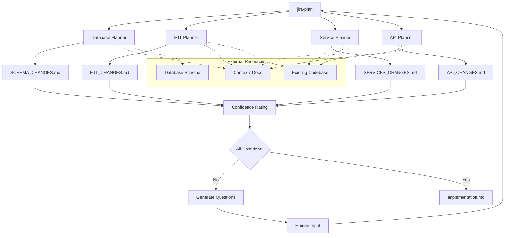
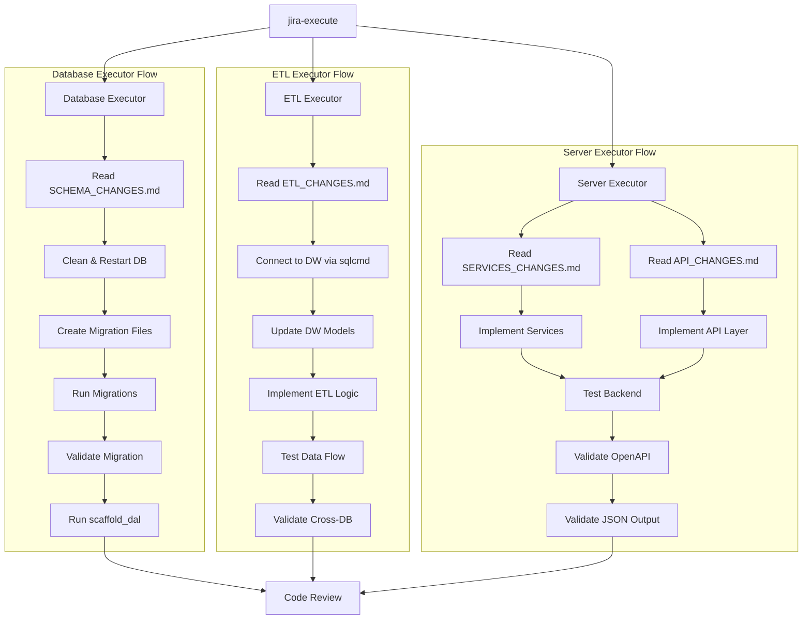

# JIRA-Driven Development Architecture

## Overview

This architecture defines an automated development workflow that transforms JIRA tickets into fully implemented features through a series of specialized planning and execution agents.

## Workflow Phases

### 1. Initial Processing

#### `/jira-description`

- **Input**: Plaintext feature description
- **Output**: Populated JIRA ticket with high-level and technical descriptions
- **Purpose**: Standardize and enrich feature requirements

#### `/jira-plan`

- **Input**: JIRA description
- **Process**:
  1. Creates planning files in `/.work/JIRA-TICKET/*`
  2. **Spawns specialized planner agents in parallel**
  3. **Real-time coordination between planners**
  4. Iterative confidence assessment and replanning
  5. Generates final `implementation.md` with execution instructions
- **Output**: Complete implementation plan linking to executor-specific plans
- **Parallel Execution**: All planners run concurrently with smart dependency management

### 2. Planning Agents (Parallel Execution)

All planners execute concurrently with smart coordination and output confidence ratings while utilizing Context7 for documentation access.

#### Database Planner (Priority: Foundational)

- **Responsibility**: Schema change analysis
- **Expertise**: Database best practices, migration strategies
- **Output**: `SCHEMA_CHANGES.md`
- **Parallel Role**: First-layer foundation providing schema updates to all other planners in real-time

#### ETL Planner (Priority: Independent)

- **Responsibility**: Data warehouse integration changes
- **Expertise**: Data warehouse understanding, Kevin's ETL patterns
- **Output**: `ETL_CHANGES.md`
- **Context**: Understands existing ETL architecture and data flows
- **Parallel Role**: Independent analysis with database coordination for schema alignment

#### Service Planner (Priority: Coordination Hub)

- **Responsibility**: Business logic implementation
- **Input**: Real-time `SCHEMA_CHANGES.md` + feature description
- **Expertise**: Best practices, Mapperly patterns, service architecture
- **Output**: `SERVICES_CHANGES.md`
- **Parallel Role**: Mid-layer coordinator bridging database/ETL outputs with API requirements

#### API Planner (Priority: Integration)

- **Responsibility**: API layer implementation
- **Input**: Real-time `SERVICES_CHANGES.md`
- **Expertise**: OpenAPI documentation, validation, JSON structure design
- **Output**: `API_CHANGES.md`
- **Parallel Role**: Integration layer waiting for service specifications before finalizing API contracts

### 3. Execution Phase

#### `/jira-execute`

- **Process**: Reads implementation/review files and spawns executor agents
- **Coordination**: Manages execution sequence and dependencies

#### Database Executor

- **Input**: `SCHEMA_CHANGES.md`
- **Capabilities**:
  - Database cleanup and restart
  - Migration file creation and execution
  - Migration validation
  - DAL scaffolding (`scaffold_dal`)

#### ETL Executor

- **Input**: `ETL_CHANGES.md`
- **Capabilities**:
  - Data warehouse connection via sqlcmd
  - DW model creation and updates
  - Service architecture adherence
  - ETL execution and validation
  - Cross-database query validation

#### Server Executor

- **Input**: `SERVICES_CHANGES.md` + `API_CHANGES.md`
- **Capabilities**:
  - Backend service implementation
  - API endpoint testing and validation
  - OpenAPI compliance verification
  - JSON output validation against view models

### 4. Quality Assurance

#### `/implementation-reviewer`

- **Process**:
  1. Reviews all planning documents
  2. Analyzes git differences against plans
  3. Creates confidence assessment
  4. Provides implementation feedback

#### `/test-implementer`

- **Input**: Service and API plans
- **Output**: Unit tests and E2E test coverage
- **Focus**: Critical path and integration testing

### 5. Finalization

#### `/finalize`

- **Process**:
  1. Runs linters and formatters
  2. Creates pull request
  3. Updates JIRA ticket description and status
- **Output**: Production-ready feature with complete documentation

## Mermaid Diagrams

### High-Level Workflow



### Planning Phase Architecture



### Execution Phase Architecture



## Key Architectural Principles

### Confidence-Driven Planning

- Iterative planning with confidence scoring
- Automatic replanning when confidence is low
- Question-driven refinement process

### Specialized Expertise

- Domain-specific planners and executors
- Context7 integration for up-to-date documentation
- Best practice enforcement at each layer

### Validation at Every Stage

- Cross-layer validation (schema → services → API)
- Automated testing integration
- Code quality enforcement

### Traceability

- Complete audit trail from JIRA to implementation
- Plan-to-code validation
- Automated documentation updates

## File Structure

```
/.work/JIRA-TICKET-{ID}/
├── implementation.md         # Master implementation plan
├── SCHEMA_CHANGES.md        # Database changes
├── ETL_CHANGES.md           # Data warehouse changes
├── SERVICES_CHANGES.md      # Business logic changes
├── API_CHANGES.md           # API layer changes
└── review/                  # Review and feedback files
```

## Integration Points

- **JIRA**: Ticket management and status tracking
- **Context7**: Live documentation and best practices
- **Git**: Code review and change tracking
- **Database**: Schema migration and validation
- **Data Warehouse**: ETL testing and validation
- **Testing Framework**: Automated test generation

This architecture ensures consistent, high-quality feature delivery while maintaining full traceability from business requirements to production code.
