# GAAStat Database Schema

This document provides a comprehensive Entity Relationship Diagram (ERD) for the GAAStat database schema, designed to store and analyze GAA football statistics as outlined in the Drum Analysis 2025 Excel data structure.

## Database Architecture Overview

The database follows a normalized structure with clear separation between core match data, detailed analytics, reference tables, and pre-calculated aggregations. The schema is optimized for GAA statistics processing and supports comprehensive performance analysis.

## Entity Relationship Diagram

```mermaid
erDiagram
    %% Core Tables
    matches {
        int match_id PK
        int match_number
        date date
        varchar drum_score
        varchar opposition_score
        int drum_goals
        int drum_points
        int opposition_goals
        int opposition_points
        int point_difference
        int competition_id FK
        int season_id FK
        int venue_id FK
        int match_result_id FK
        int opposition_id FK
    }

    players {
        int player_id PK
        varchar player_name
        int jersey_number
        boolean is_active
        int position_id FK
    }

    match_team_statistics {
        int match_team_stat_id PK
        int match_id FK
        decimal drum_first_half
        decimal drum_second_half
        decimal drum_full_game
        decimal opposition_first_half
        decimal opposition_second_half
        decimal opposition_full_game
        int metric_definition_id FK
    }

    match_player_statistics {
        int match_player_stat_id PK
        int match_id FK
        int player_id FK
        int minutes_played
        int total_engagements
        decimal engagement_efficiency
        varchar scores
        decimal possession_success_rate
        decimal possessions_per_te
        int total_possessions
        int turnovers_won
        int interceptions
        int total_attacks
        int kick_retained
        int kick_lost
        int carry_retained
        int carry_lost
        int shots_total
        int goals
        int points
        int wides
        decimal conversion_rate
        int tackles_total
        int tackles_contact
        int tackles_missed
        decimal tackle_percentage
        int frees_conceded_total
        int yellow_cards
        int black_cards
        int red_cards
        int kickouts_total
        int kickouts_retained
        int kickouts_lost
        decimal kickout_percentage
        int saves
    }

    %% Analytics Tables
    kickout_analysis {
        int kickout_analysis_id PK
        int match_id FK
        int total_attempts
        int successful
        decimal success_rate
        json outcome_breakdown
        int time_period_id FK
        int kickout_type_id FK
        int team_type_id FK
    }

    shot_analysis {
        int shot_analysis_id PK
        int match_id FK
        int player_id FK
        int shot_number
        varchar time_period
        int shot_type_id FK
        int shot_outcome_id FK
        int position_area_id FK
    }

    scoreable_free_analysis {
        int scoreable_free_id PK
        int match_id FK
        int player_id FK
        int free_number
        varchar distance
        boolean success
        int free_type_id FK
        int shot_outcome_id FK
    }

    positional_analysis {
        int positional_analysis_id PK
        int match_id FK
        int position_id FK
        decimal avg_engagement_efficiency
        decimal avg_possession_success_rate
        decimal avg_conversion_rate
        decimal avg_tackle_success_rate
        int total_scores
        int total_possessions
        int total_tackles
    }

    %% Reference/Lookup Tables
    competitions {
        int competition_id PK
        varchar competition_name
        varchar season
        int competition_type_id FK
    }

    teams {
        int team_id PK
        varchar team_name
        varchar home_venue
        varchar county
    }

    seasons {
        int season_id PK
        varchar season_name
        date start_date
        date end_date
        boolean is_current
    }

    positions {
        int position_id PK
        varchar position_name
        varchar position_category
        varchar description
    }

    metric_categories {
        int metric_category_id PK
        varchar category_name
        text description
    }

    metric_definitions {
        int metric_id PK
        varchar metric_name
        text metric_description
        varchar data_type
        text calculation_method
        int metric_category_id FK
    }

    kpi_definitions {
        int kpi_id PK
        varchar kpi_code
        varchar kpi_name
        text description
        text calculation_formula
        json benchmark_values
        varchar position_relevance
    }

    venues {
        int venue_id PK
        varchar venue_code
        varchar venue_description
    }

    match_results {
        int match_result_id PK
        varchar result_code
        varchar result_description
    }

    competition_types {
        int competition_type_id PK
        varchar type_name
        varchar description
    }

    time_periods {
        int time_period_id PK
        varchar period_name
        varchar description
    }

    kickout_types {
        int kickout_type_id PK
        varchar type_name
        varchar description
    }

    team_types {
        int team_type_id PK
        varchar type_name
        varchar description
    }

    shot_types {
        int shot_type_id PK
        varchar type_name
        varchar description
    }

    shot_outcomes {
        int shot_outcome_id PK
        varchar outcome_name
        varchar description
        boolean is_score
    }

    position_areas {
        int position_area_id PK
        varchar area_name
        varchar description
    }

    free_types {
        int free_type_id PK
        varchar type_name
        varchar description
    }

    %% Aggregation Tables
    season_player_totals {
        int season_total_id PK
        int player_id FK
        int season_id FK
        int games_played
        int total_minutes
        decimal avg_engagement_efficiency
        decimal avg_possession_success_rate
        int total_scores
        int total_goals
        int total_points
        decimal avg_conversion_rate
        int total_tackles
        decimal avg_tackle_success_rate
        int total_turnovers_won
        int total_interceptions
    }

    position_averages {
        int position_avg_id PK
        int position_id FK
        int season_id FK
        decimal avg_engagement_efficiency
        decimal avg_possession_success_rate
        decimal avg_conversion_rate
        decimal avg_tackle_success_rate
        decimal avg_scores_per_game
        decimal avg_possessions_per_game
        decimal avg_tackles_per_game
    }

    %% Primary Relationships
    matches ||--o{ match_team_statistics : "has"
    matches ||--o{ match_player_statistics : "has"
    matches ||--o{ kickout_analysis : "has"
    matches ||--o{ shot_analysis : "has"
    matches ||--o{ scoreable_free_analysis : "has"
    matches ||--o{ positional_analysis : "has"
    
    players ||--o{ match_player_statistics : "has"
    players ||--o{ shot_analysis : "takes"
    players ||--o{ scoreable_free_analysis : "takes"
    players ||--o{ season_player_totals : "accumulates"
    
    %% Foreign Key Relationships
    competitions ||--o{ matches : "includes"
    seasons ||--o{ matches : "contains"
    venues ||--o{ matches : "designates"
    match_results ||--o{ matches : "determines"
    teams ||--o{ matches : "opposes"
    competition_types ||--o{ competitions : "categorizes"
    positions ||--o{ players : "categorizes"
    positions ||--o{ positional_analysis : "analyzes"
    positions ||--o{ position_averages : "benchmarks"
    metric_categories ||--o{ metric_definitions : "categorizes"
    metric_definitions ||--o{ match_team_statistics : "defines"
    time_periods ||--o{ kickout_analysis : "specifies"
    kickout_types ||--o{ kickout_analysis : "categorizes"
    team_types ||--o{ kickout_analysis : "identifies"
    shot_types ||--o{ shot_analysis : "categorizes"
    shot_outcomes ||--o{ shot_analysis : "determines"
    shot_outcomes ||--o{ scoreable_free_analysis : "determines"
    position_areas ||--o{ shot_analysis : "locates"
    free_types ||--o{ scoreable_free_analysis : "categorizes"
    
    %% Aggregation Relationships
    seasons ||--o{ season_player_totals : "summarizes"
    seasons ||--o{ position_averages : "benchmarks"
```

## Table Categories

### Core Tables (Blue)
These tables store the fundamental match and player data:
- **matches**: Match information, results, and basic statistics
- **players**: Player master data and position information
- **match_team_statistics**: Detailed team-level performance metrics (235+ data points per match)
- **match_player_statistics**: Individual player performance data (80+ fields per player per match)

### Analytics Tables (Green)
Specialized tables for detailed performance analysis:
- **kickout_analysis**: Detailed kickout performance tracking by type and period
- **shot_analysis**: Individual shot tracking with outcome and location data
- **scoreable_free_analysis**: Free kick performance with distance and success tracking
- **positional_analysis**: Position-based aggregated statistics per match

### Reference Tables (Yellow)
Lookup and master data tables:
- **competitions**: Competition master data
- **competition_types**: Competition type classifications (League, Championship, Cup)
- **teams**: Opposition team information
- **seasons**: Season management and date ranges
- **positions**: Playing position definitions and categories
- **venues**: Home/Away venue designations
- **match_results**: Match outcome types (Win, Loss, Draw)
- **time_periods**: Game period classifications (First Half, Second Half, Full Game)
- **kickout_types**: Kickout classifications (Long, Short)
- **team_types**: Team type designations (Drum, Opposition)
- **shot_types**: Shot type classifications (From Play, Free Kick, Penalty)
- **shot_outcomes**: Shot outcome types (Goal, Point, Wide, Save, etc.)
- **position_areas**: Field position areas (Attacking Third, Middle Third, Defensive Third)
- **free_types**: Free kick types (Standard, Quick)
- **metric_categories**: Statistical metric category groupings
- **metric_definitions**: Statistical metric explanations and calculation methods
- **kpi_definitions**: KPI definitions with formulas and benchmark values

### Aggregation Tables (Purple)
Pre-calculated summary tables for performance optimization:
- **season_player_totals**: Player season statistics and averages
- **position_averages**: Position-based benchmark comparisons

## Key Relationships

1. **Match-centric Design**: All statistical data relates to specific matches
2. **Player Performance Tracking**: Comprehensive player statistics across all matches
3. **Position-based Analysis**: Statistics grouped by playing positions for tactical analysis
4. **Seasonal Aggregation**: Pre-calculated totals for quick reporting and benchmarking
5. **Flexible Analytics**: Specialized tables for detailed analysis of key game aspects

## Data Integrity Features

- **Score Validation**: Goals and points must match formatted scores
- **Percentage Constraints**: All percentage fields between 0 and 1
- **Time Validation**: Minutes played ≤ match duration
- **Statistical Consistency**: Team totals must equal sum of player stats
- **Period Validation**: First half + Second half = Full game totals

## Performance Optimization

The schema includes strategic indexes for common query patterns:
- Match date and opposition lookups
- Player name searches
- Statistical analysis queries
- Position-based aggregations

## Storage Estimates

- **Per Match**: ~250KB (50KB team stats + 200KB player stats)
- **Per Season**: ~2MB for 8 matches
- **Annual**: ~8MB for full season (32 matches)

This schema design supports comprehensive GAA statistics analysis while maintaining data integrity and query performance.